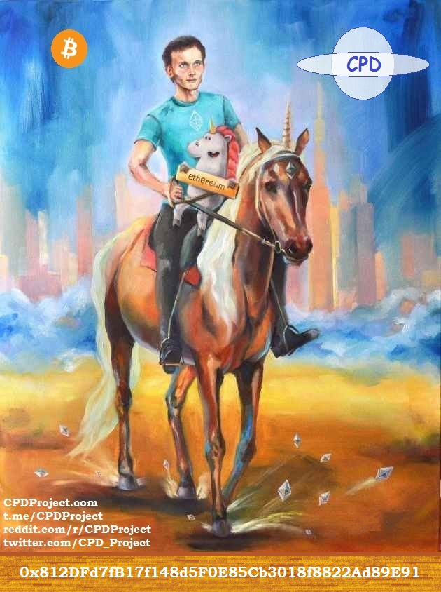

# CPD Puzzle

An attempt to solve the cpd puzzle for a prize of 100 ETH

- [Summary](#summary)
- [Official articles](#official-hints)

## Summary

- Previous image is the key to find private key of this address. Anyone, who finds the private key, can sweep it.
- Address is [0x812DFd7fB17f148d5F0E85Cb3018f8822Ad89E91](https://etherscan.io/address/0x812DFd7fB17f148d5F0E85Cb3018f8822Ad89E91)
- [Address Ownership Verification](https://etherscan.io/verifySig/2021)

## Official hints

- **May 12, 2020:** Follow the Roadmap.
- **June 1, 2020:** Five keywords will become a 64 digit hexadecimal number through various transformations.
- **July 1, 2020:** Dates are in YYYYMonthDD format.
- **August 1, 2020:** Crypto Assets are represented by three capital letters.
- **September 1, 2020:** Date strings are transformed from ASCII to Decimal.
- **October 1, 2020:** Crypto string is transformed from Base58 to Decimal.
- **November 1, 2020:** Months are powerful.
- **December 1, 2020:** Apply SHA256 and repeat for all the auction months.
